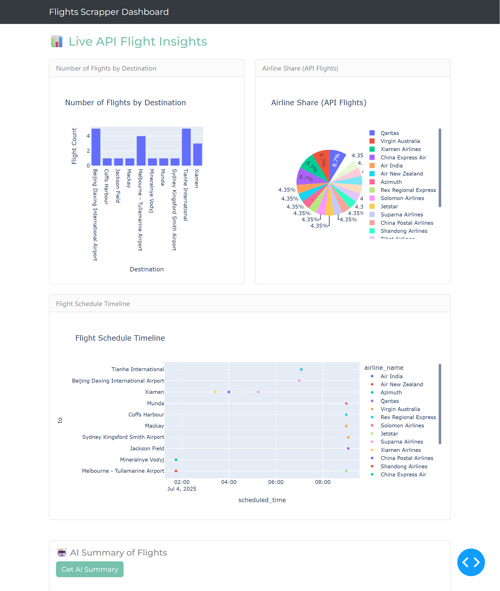

# Monitor Flight Prices using Dash and Plotly


---

## Overview

This project fetches live flight data from the [AviationStack API](https://aviationstack.com/), processes it with Python and Pandas, and visualizes it using Dash and Plotly. The dashboard provides insights into flight schedules, airline shares, and route popularity. An AI-powered summary (using Google Gemini) offers quick, actionable insights from the data.

---

## Dashboard Preview

<p align="center">
  
</p>

---

## Features

- **Live Data Fetching:** Retrieves up-to-date flight data from the AviationStack API.
- **Data Processing:** Cleans and structures flight data with Pandas.
- **Interactive Dashboard:** Visualizes flight trends, airline shares, and schedules using Dash and Plotly.
- **AI Insights:** Summarizes key trends and patterns using Google Gemini.
- **Easy to Run:** No web scraping or Selenium required—just an API key.

---

## Getting Started

### 1. Clone the Repository

```sh
git clone https://github.com/ChitrakshSuri/Airline-Demand-Tracker
cd Airline-Demand-Tracker
```

### 2. Install Dependencies

It’s recommended to use a virtual environment:

```sh
python -m venv venv
venv\Scripts\activate  # On Windows
pip install -r requirements.txt
```

### 3. Set Up API Keys

Create a `.env` file in the project root with your AviationStack and Gemini API keys:

```
AVIATION_STACK_API_KEY=your_aviationstack_key
GEMINI_API_KEY=your_gemini_key
```

### 4. Fetch Flight Data

```sh
python fetch_api_flights.py
```

This will create or update `api_flight_data.csv`.

### 5. Launch the Dashboard

```sh
python index.py
```

Visit [http://127.0.0.1:8050/](http://127.0.0.1:8050) in your browser.

---

## Project Structure

```
Monitor-Webscraped-Flight-Prices-using-Dash-and-Plotly/
│
├── fetch_api_flights.py           # Fetches flight data from AviationStack API
├── api_flight_data.csv            # Latest flight data (generated)
├── index.py                       # Dash app entry point
├── requirements.txt               # Python dependencies
├── src/
│   ├── pages/
│   │   └── ApiAnalytics.py        # Dashboard layout and figures
│   └── utils/
│       └── gemini.py              # AI summary utility (Google Gemini)
└── README.md
```

---

## Built With

- [Python](https://www.python.org/)
- [Pandas](https://pandas.pydata.org/)
- [Dash](https://dash.plotly.com/)
- [Plotly](https://plotly.com/)
- [AviationStack API](https://aviationstack.com/)
- [Google Gemini](https://ai.google.dev/gemini-api/docs/quickstart)

---

## License

This project is open-source and available under the [MIT License](LICENSE).

---

## Acknowledgements

- Flight data provided by [AviationStack](https://aviationstack.com/).
- Dashboard UI powered by [Dash](https://dash.plotly.com/) and [Plotly](https://plotly.com/).
- AI summaries powered by [Google Gemini](https://ai.google.dev/).

---

**Feel free to contribute or suggest improvements!**
